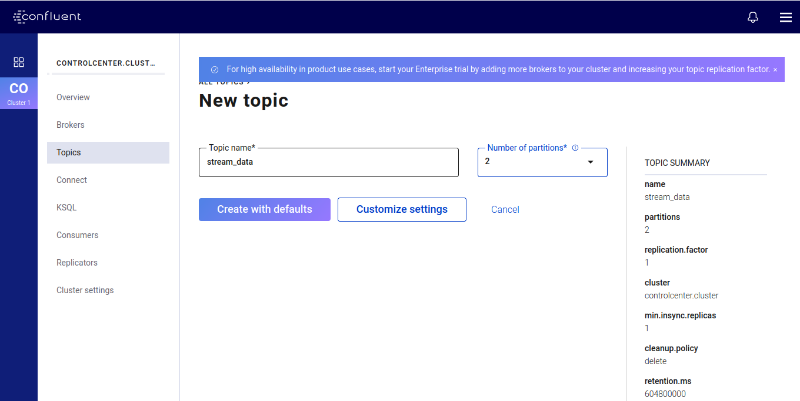

# Simple Data Stream Anomaly Detection

Simple Real time data stream anomaly detection using Kafka and Python.
## Installation

1. Creating virtual environment

```bash
python3 -m venv env
```

2. Activate virtual environment

```bash
source env/activate
```

3. install dependencies

```bash
pip install -r requirements.txt
```

4. Due to the complexity of managing a manual Kafka install, a docker-compose script is used. The Docker images are provided by Confluent, a Kafka tool vendor. The script defines the following services

```bash
docker compose up
```
5. open browser and type this will open Control Center GUI
```bash
localhost:9021
```
6. create a new `stream_data` topic with 2 partitions and default settings.


7. Run script for generating data

```bash
python3 data_producer.py
```

8. Run script for consuming data

```bash
python3 data_consumer.py
```

8. after the fishing down the running containers
```bash
docker compose down
```
9. close scripts using `CTRL` +`C`